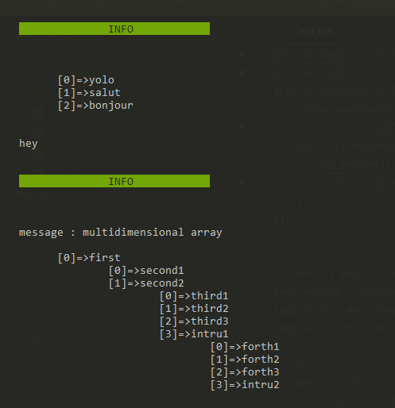

1°) Import log function.

```js
import {log} from './pretty_log.js'
log('title (warning, error, info ...)', 'your message', 'your array');
```

2°) Then, in your terminal : "node yourfile.js".


Example: 

```js
let array = ['yolo', 'salut', 'bonjour'];
let multidimArray = ['first', 
['second1', 'second2', 
['third1', 'third2','third3','intru1'], 
['forth1', 'forth2','forth3','intru2']]];

log('info', array, 'hey');
log('info', 'message : multidimensional array', mutlidimArray);
```
Result : 

<p align="center">
  
</p>